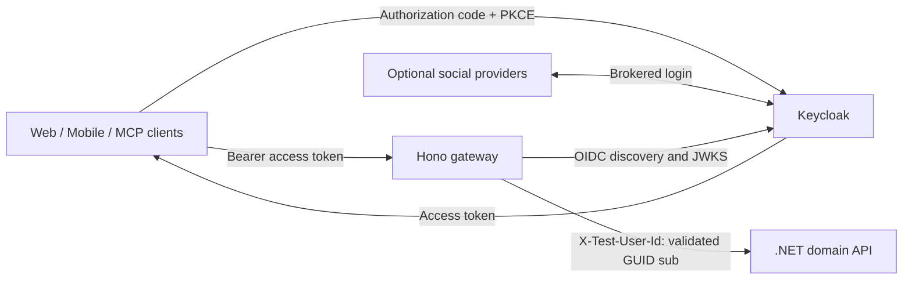

# Maletapp gateway architecture

This document describes the current scaffold and distinguishes it from planned work. Keep it with the gateway code; use [decision records](decisions/0001-external-identity-mapping.md) for architectural rationale and the [README](../README.md) for setup instructions.

## System boundary

The gateway runs Hono and TypeScript on Node.js 24. The `api/` component owns the .NET 10 domain API, business rules, and trip/item ownership checks. Keycloak owns authentication; local users work without configuring social providers. Clients own the login flow and token acquisition, including the gateway-hosted development Swagger client at `/docs`.

## Request pipeline

1. The web route group has a passthrough session middleware hook. All groups currently require Bearer authentication.
2. Shared authentication discovers `jwks_uri` from `KEYCLOAK_AUTHORITY` and validates the signature with Hono's `verifyWithJwks`, allowing RS256 only. It checks the exact issuer, configured audience, expiry and applicable time claims, and requires a nonempty subject.
3. The current domain contract requires a GUID subject. Missing or invalid authentication returns JSON 401; an otherwise valid non-GUID subject returns JSON 403. Both use `{ "error": "unauthorized" }` and stop before the domain request.
4. The proxy removes client-supplied credentials, cookies, forwarded headers, user identity headers and hop-by-hop headers. It injects the validated GUID into `X-Test-User-Id`.
5. The proxy forwards the method, path, query and body to the configured domain origin. It streams the response, does not follow redirects, normalizes domain 401/403 errors, and returns JSON 502 for upstream fetch failures.

The exact header is defined in the domain's `src/Trip.API/Infrastructure/UserContext/UserContextHeaderNames.cs:7`. Its `HttpUserContextAccessor.cs:24-35` parses the header as a GUID, falling back to a GUID NameIdentifier claim. The source describes this header as a development/test shortcut. The domain does not validate JWTs.

## BFF surface

| Gateway routes | Domain routes | Current behavior |
|---|---|---|
| `/trips`, `/items`, and other raw paths | Same path | Authenticated proxy |
| `/web/*` | Client prefix removed | Session hook, then Bearer authentication |
| `/mobile/*` | Client prefix removed | Bearer authentication |
| `/mcp/*` | Client prefix removed | Bearer authentication; no MCP protocol server |

The development Swagger UI is served from the gateway origin. There is no application frontend, cookie session implementation, or API CORS configuration. Local browser clients can use a same-origin frontend development proxy.

## Deployment and trust

| Service | Local address | Docker networks |
|---|---|---|
| Gateway | `http://localhost:5000` → container 3000 | `edge`, `internal` |
| Keycloak | `http://localhost:8080` | `edge` |
| Domain API | `http://domain-api:5110`, no host port | `internal` only |

The `internal` network is private and shared only by gateway and domain containers in this Compose stack. The domain trusts the injected identity within this PoC boundary. Its Dockerfile lives in `gateway/` and builds the API source from the monorepo.

The public issuer is `http://localhost:8080/realms/maletapp`. Compose uses `KEYCLOAK_INTERNAL_ORIGIN=http://keycloak:8080` to route discovery and JWKS internally while preserving exact public issuer validation and browser OAuth URLs. No hosts-file entry is needed. The imported realm provides a public PKCE client and the `api://maletapp` audience. Keycloak uses a persistent volume; the domain uses EF Core InMemory and loses its data on restart.

The included Compose stack is for development. HTTP discovery/JWKS is allowed only when `NODE_ENV=development`; other environments require HTTPS identity endpoints. Discovery metadata is cached until restart, with failed discovery retried on later requests. JWKS is fetched per request. Identity fetches have 5-second timeouts and domain fetches a 30-second timeout.

## Planned changes

- **Accepted, not implemented:** persistent `(issuer, subject) -> internal user GUID` mapping, preserving the domain GUID model. See [ADR 0001](decisions/0001-external-identity-mapping.md) for atomic creation, ownership migration and verified account linking. Changing the authority alone does not migrate users. Renaming the test header is a separate coordinated change.
## Development documentation

Exact `/docs` asset, OpenAPI and OAuth callback GET/HEAD handlers precede JWT middleware only in development. The UI uses local pinned Swagger assets and a dedicated public `maletapp-swagger` authorization-code/S256 client. Token persistence is disabled. The gateway fetches the generated domain Swagger JSON, replaces server targets with `/`, and adds OAuth endpoints from shared validated OIDC discovery. Schema fetches and failed discovery retry without restarts; the UI retries readiness errors. Compose enables domain Development while retaining its private network.

Outside development, the `/docs` namespace and upstream `/swagger` paths (including BFF prefixes) return 404. All API routes retain shared JWT validation. See the README for exact callback/client settings and existing-volume updates.

## Code and verification

- [App and route groups](../src/app.ts)
- [JWT authentication](../src/auth.ts) and [OIDC discovery](../src/oidc.ts)
- [Development Swagger](../src/docs.ts)
- [Proxy and identity injection](../src/proxy.ts)
- [Web session hook](../src/bff/web.ts)
- [Configuration](../src/config.ts)
- [Compose topology](../docker-compose.yml)
- [Integration tests](../test/gateway.test.ts)

TypeScript build/typecheck and all 18 tests passed using local OIDC/JWKS and upstream HTTP servers plus a VM check of UI initialization. Docker startup and live schema/discovery checks pass. Browser tools are unavailable; real interactive login/callback/API requests remain unverified.
