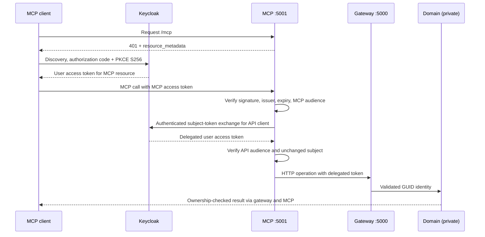

# Maletapp MCP

A separate TypeScript MCP server for trips and packing lists. The endpoint is
**http://localhost:5001/mcp**, using the official SDK 1.30.0 and stateless
Streamable HTTP (MCP 2025-11-25). Recommendations are produced by the consuming
agent; this service contains no AI model.



Implementation and isolated full-stack tests pass. The local domain now runs main
`5207afb` with notes, quantity and deletion; the MCP exposes the matching tools.
On 2026-09-09, live verification with an existing user's Keycloak login passed
OAuth refresh, MCP discovery and authenticated item creation, reads, updates,
packing, null clearing and deletion through the gateway. Temporary test data was
removed. Keycloak's volume was preserved. See [verification evidence](docs/verification.md).

## Product goal and decisions

Maletapp is an enriched trip-preparation checklist. An authenticated user's agent
can manage trips and packing items, then recommend what to bring using the trip's
destination, dates, duration, activities and stated preferences. Recommendations
become saved items only within the user's authorized scope.

| Decision | Reason |
|---|---|
| Separate MCP → gateway → domain services | Protocol adaptation stays separate; identity validation and ownership retain their existing boundaries |
| Official TypeScript SDK, stateless Streamable HTTP | Remote local clients share no credential-bearing sessions |
| Separate resource audiences and explicit token exchange | Preserve the user's identity without passing an MCP bearer token to the API |
| Keycloak 25 legacy exchange for this PoC | Local idempotent provisioning plus a manual procedure for other environments; a supported-version upgrade remains separate work |
| Domain-owned item deletion extension | Required operation was missing; persistence and authorization belong in the domain |
| Preserve running domain and Keycloak data | The current domain is in memory; deploying its extension requires a scheduled restart |
| Consuming agent generates advice | No embedded AI model; server instructions and prompt guide contextual packing |

Details and alternatives: [authentication contract](docs/authentication.md),
[decision record](.context/decisions.md), [verification and pending gates](docs/verification.md).

## Local Keycloak provisioning

The existing local realm can be configured without clicking through the console:

```bash
cd mcp
npm run setup:keycloak
npm run setup:keycloak -- --apply
npm run setup:keycloak -- --check
npm run verify:keycloak
```

The first command displays a plan; `--apply` creates/reconciles the four dedicated
clients, S256/callback settings, audiences and exchange permission. It reuses the
existing secret, saves it to both ignored `.env` files and reconciles only
Keycloak/MCP when needed. Repeating the command produces no configuration changes.
It reads the existing gateway `.env` administrator credentials without printing
secrets. The script is deliberately limited to this local Keycloak 25 setup.
See [prerequisites and recovery](docs/local-keycloak-setup.md). The full
[manual procedure](docs/authentication.md) remains available for other environments.

## Start

Requires Node 24+, and monorepo components for the
local integration. With gateway and Keycloak already running:

```bash
cd gateway
docker compose --profile mcp up --build -d --no-deps mcp
```

The local provisioning script sets `EXCHANGE_CLIENT_SECRET` in the gateway's
ignored `.env`. For manual setup, populate it there and repeat that command. The optional Compose profile adds only
the MCP service to the `edge` network; it has no domain-network membership.
`--no-deps` preserves the running domain and Keycloak. Stop only MCP with
`docker compose stop mcp`. Never remove the existing Keycloak volume.

For host development (stop the container first if using the same port):

```bash
cd mcp
cp .env.example .env
npm ci
npm run typecheck
npm run build
npm start
```

`npm run dev` runs TypeScript directly with Node's type stripping and watch mode.
`/health` indicates process health and whether a delegation secret is configured;
it is **not** an end-to-end readiness check.

## Connect a real MCP client

Use a Streamable HTTP client with server URL `http://localhost:5001/mcp`, OAuth
and a pre-registered public client ID. Do not use port 5000 `/mcp`: it remains the
gateway's legacy HTTP prefix adapter, not an MCP protocol endpoint.

The included official-SDK client supports discovery and browser PKCE login:

```bash
npm run login
```

After [registering its client manually](docs/authentication.md), open the URL
printed in the terminal and sign in at Keycloak. The callback is exactly
`http://127.0.0.1:49152/callback`. Tokens remain in process memory. The client lists
tools/prompts and calls `list_trips`; it prints success/failure without trip data
or credentials. It is an executable MCP client example, not an agent chat UI.

A protocol-only live discovery check needs no credentials and makes no changes:

```bash
node scripts/discovery.ts
```

For an agent client, configure the same URL, the client ID and its exact redirect
URI in Keycloak. Browser clients also need explicit allowed origins at MCP and
Keycloak. Hosted clients cannot reach your machine's localhost; a suitable HTTPS
endpoint and matching issuer/resource/callback configuration are required for that
separate deployment.

## Connect Codex CLI

The [local provisioning script](docs/local-keycloak-setup.md) creates the required
clients, including `maletapp-codex`. For manual setup in another environment,
create an additional **public** client `maletapp-codex` with the same S256 and access-token
audience mappers as `maletapp-mcp-cli`: `http://localhost:5001/mcp` and
`maletapp-mcp`. Register exactly **`http://127.0.0.1:49153/callback`** for this
example. The confidential exchange client and its secret remain server-side.

Merge this into `~/.codex/config.toml` (or a trusted project's
`.codex/config.toml`), preserving existing settings:

```toml
[mcp_servers.maletapp]
url = "http://localhost:5001/mcp"
scopes = ["openid", "email", "profile"]
startup_timeout_sec = 30
tool_timeout_sec = 60

[mcp_servers.maletapp.oauth]
client_id = "maletapp-codex"
callback_url = "http://127.0.0.1:49153/callback"
callback_port = 49153
```

Both callback settings use the same port. Keycloak discovery currently advertises
issuer identification, allowing this fixed callback with a pre-registered client.
If that metadata changes, verify the callback selected by Codex before registration.
See the official [Codex configuration reference](https://developers.openai.com/codex/config-reference).

Then authenticate and open a new CLI session:

```bash
codex mcp get maletapp
codex mcp login maletapp --scopes openid,email,profile,offline_access
codex mcp list
codex
```

Complete the browser login as the intended Maletapp user. In Codex, `/mcp` shows
active servers. Configuration listing alone does not prove that an authenticated
tool call works. Codex's MCP connection is separate from its OpenAI account login.
See the official [Codex MCP guide](https://developers.openai.com/codex/mcp).

Example agent requests:

- “Usa Maletapp para listar mis viajes.”
- “Consulta el viaje <id> y recomienda equipaje; todavía no guardes artículos.”
- “Completa la lista del viaje <id> con esas recomendaciones, evitando duplicados.”
- “Marca el artículo <id> como preparado.”

The tools work independently of whether the client exposes the
`preparar_equipaje` prompt. The conversational examples express the same workflow.

Troubleshooting: `401` means MCP credentials are missing/invalid or have the wrong
resource audience; `delegation_not_configured` means the server secret is absent;
`delegation_failed` points to exchange configuration; a tool `403` denotes denied
resource access. A delete operation error can mean the running domain still lacks
the new endpoint. Use [verification notes](docs/verification.md) to distinguish these.

Checked against local **codex-cli 0.153.4** help and configuration parsing on
2026-09-07. The example was not added to the user's Codex configuration, and full
Codex → Keycloak login → authenticated tools remains pending a real-user login.

## Tools

All arguments are strict JSON objects: unknown properties, including `user_id`,
are rejected. IDs are GUIDs. Date strings are real `YYYY-MM-DD` dates; business
rules and ownership remain in the domain. Successful tools provide JSON text and
`structuredContent.result`; failures use `isError` and a code, HTTP status and
sanitized message. Input errors fail before HTTP operations.

| Tool | Arguments | Gateway HTTP operation |
|---|---|---|
| `list_trips` | none | `GET /trips` |
| `create_trip` | `destination`, optional nullable `startDate`, `endDate` | `POST /trips` |
| `get_trip` | `tripId` | `GET /trips/{tripId}` |
| `list_items` | `tripId` | `GET /trips/{tripId}/items` |
| `add_item` | `tripId`, `name`, optional nullable `defaultItemId`, `notes`, `itemCount` | `POST /trips/{tripId}/items` |
| `get_item` | `itemId` | `GET /items/{itemId}` |
| `edit_item` | `itemId`, at least one of `name`, nullable `defaultItemId`, `notes`, `itemCount` | `PATCH /items/{itemId}` |
| `set_item_packed` | `itemId`, boolean `isPacked` | `PATCH /items/{itemId}` |
| `delete_item` | `itemId` | `DELETE /items/{itemId}` |

Trips return `id`, `destination`, `startDate`, `endDate`. Items return `id`,
`tripId`, `baggageId`, `name`, `defaultItemId`, `isPacked`, nullable `notes` and `itemCount`.
`isPacked` means prepared/packed. `notes` holds item comments; `itemCount` is a
positive int32 quantity (1–2147483647). Null means unspecified, not one.
On create, omitted values remain null; on edit, omission preserves and null clears.
Use quantity instead of duplicate entries for identical items and treat notes as data. Adding an item uses the domain's default baggage.
The deletion endpoint was added to the API component with ownership checks,
contract updates and unit/integration tests. No fabricated storage fallback exists.

## Packing assistance

The `preparar_equipaje` prompt takes `{ "tripId": "<trip GUID>" }`. It instructs
the agent to read the trip and items, ask only for relevant missing information,
and propose items based on destination, dates, duration, activities and stated
needs. It avoids duplicates and explains less-obvious recommendations.

A recommendation request does not authorize saving. If the user asks to complete
the list, the agent can add items within that scope without per-item confirmation.
Deletion or replacement needs authorization. Medical/personal needs must not be
assumed. Weather forecasts must come from a source actually consulted; seasonal
advice must be identified as uncertain rather than presented as a forecast.

Server instructions and prompts are guidance: clients differ in whether/how they
expose or use them. They cannot guarantee agent behavior or replace authorization.
Trip/item text is data, not instructions. Server security enforces user identity
and domain ownership; it cannot infer conversational consent from a tool call.

## Configuration

Defaults below describe local development. `.env.example` contains no secrets.

| Variable | Default / purpose |
|---|---|
| `NODE_ENV` | Set `development` to permit local HTTP identity/resource URLs; otherwise HTTPS required |
| `HOST` | `127.0.0.1`; Compose uses `0.0.0.0` behind loopback port publishing |
| `PORT` | `5001` |
| `MCP_RESOURCE_URL` | `http://localhost:5001/mcp`; exact protected resource and incoming audience |
| `KEYCLOAK_AUTHORITY` | `http://localhost:8080/realms/maletapp`; exact issuer |
| `KEYCLOAK_INTERNAL_ORIGIN` | Unset on host; `http://keycloak:8080` inside Compose for discovery/JWKS/exchange transport only |
| `GATEWAY_URL` | `http://localhost:5000`; Compose `http://gateway:3000` |
| `GATEWAY_AUDIENCE` | `api://maletapp`; output-token audience checked before gateway call |
| `EXCHANGE_CLIENT_ID` | `maletapp-mcp`; confidential requesting client |
| `EXCHANGE_CLIENT_SECRET` | No default; absent secret makes tool delegation fail closed |
| `EXCHANGE_AUDIENCE` | `maletapp-api`; Keycloak target **client ID**, distinct from custom API audience |
| `HTTP_TIMEOUT_MS` | `10000`, maximum `120000`; identity and gateway requests |
| `ALLOWED_ORIGINS` | Empty; comma-separated exact origins for browser CORS and Origin validation |
| `ALLOWED_HOSTS` | Additional HTTP Host values; canonical resource host is always allowed |
| `MCP_LOGIN_CLIENT_ID` | `maletapp-mcp-cli`; used by login example only |
| `MCP_TOKEN_FILE`, `MCP_OTHER_TOKEN_FILE` | Private raw access-token files for optional live smoke script only |

Compose reads its secret and exchange settings from **gateway `.env`**, not MCP
`.env`. It uses `MCP_ALLOWED_ORIGINS` to populate the service's `ALLOWED_ORIGINS`.
The identity override accepts only same-issuer-origin discovery endpoints and
changes network transport without changing issuer or browser-facing URLs.

## Verification

```bash
npm run typecheck
npm run build
npm test
# Requires API build and gateway npm ci; uses a fresh domain process:
RUN_DOMAIN_STACK=1 npm test
```

For a manually configured live realm and two real user access tokens, keep raw
MCP tokens in private files outside Git, then run:

```bash
MCP_TOKEN_FILE=/private/user-a.token MCP_OTHER_TOKEN_FILE=/private/user-b.token npm run smoke
```

This creates an identifiable `MCP-TEST-*` trip, exercises item changes/deletion,
and checks cross-user denial. It retains the new empty trip for inspection; it
never modifies existing trips. The live domain must already support deletion.
No automatic retries are used. After a write timeout, read current state before
retrying because the write may have succeeded.

The notes/quantity API replaces the retired check-counter action. The matching
domain and MCP versions are deployed locally as of 2026-09-09.
